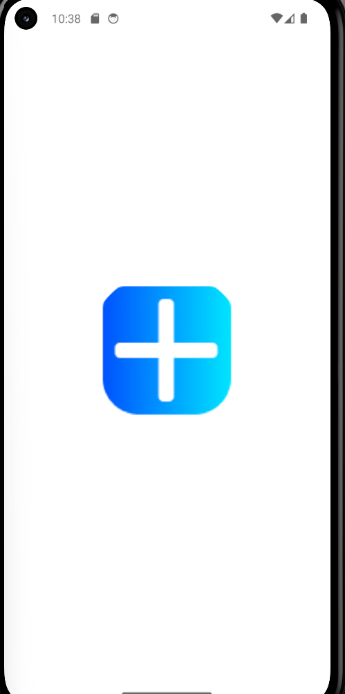
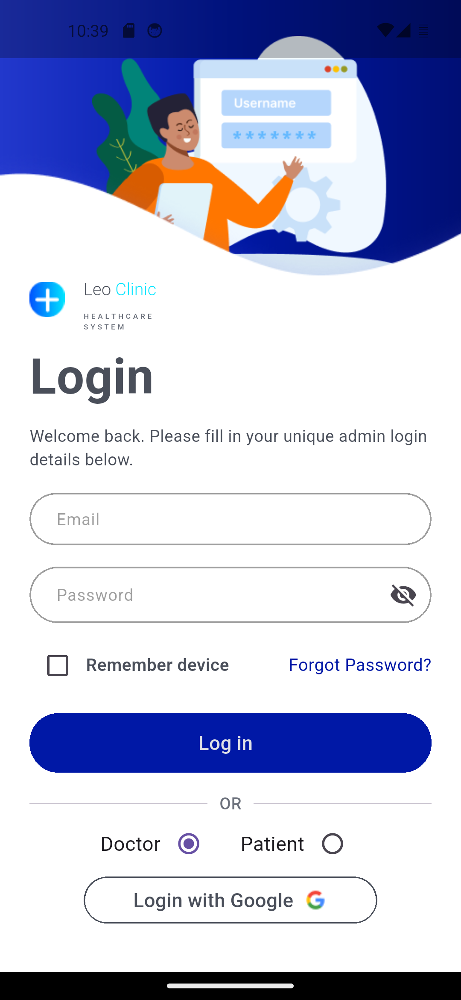
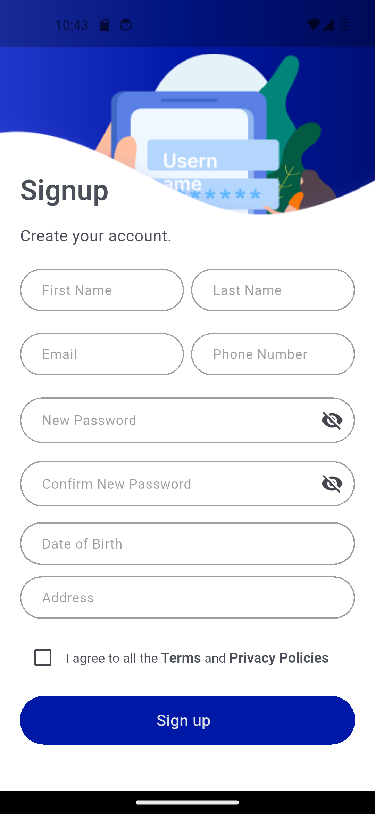
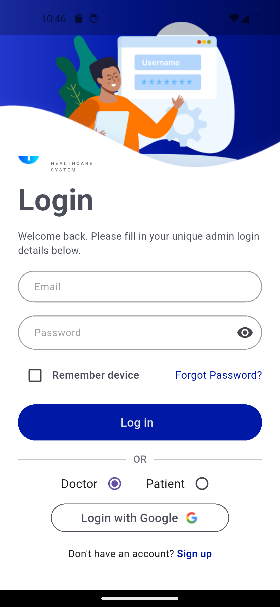

# LeoClinic Flutter 🏥

LeoClinic is a Flutter-based medical application developed with a scalable feature-based architecture and a clear separation of responsibilities between the presentation, business logic, and data layers.  
The project focuses on providing a structured foundation for healthcare-related features while maintaining clean and maintainable Flutter code.

---

## Features

- **Authentication**
  - User registration and login
  - Email verification
  - Forgot password
  - Password reset
- **Appointment Management**
- **Doctor Features**
- **Patient Features**
- **Profile Management**
- **Admin Features**
- **REST API Integration**
- **Responsive UI**

---

## 📸 App Screenshots

| Splash Screen | Login | Signup | Forgot Password | Login (Full Flow) |
| :-----------: | :---: | :----: | :-------------: | :---------------: |
|  |  |  |  |  |

---

## Architecture

The project follows a feature-based architecture with separation between the main application layers:

```text
lib/
├── core/
├── features/
│   ├── admin/
│   ├── appointments/
│   ├── authentication/
│   ├── doctor/
│   ├── patient/
│   └── profile/
├── home.dart
└── main.dart